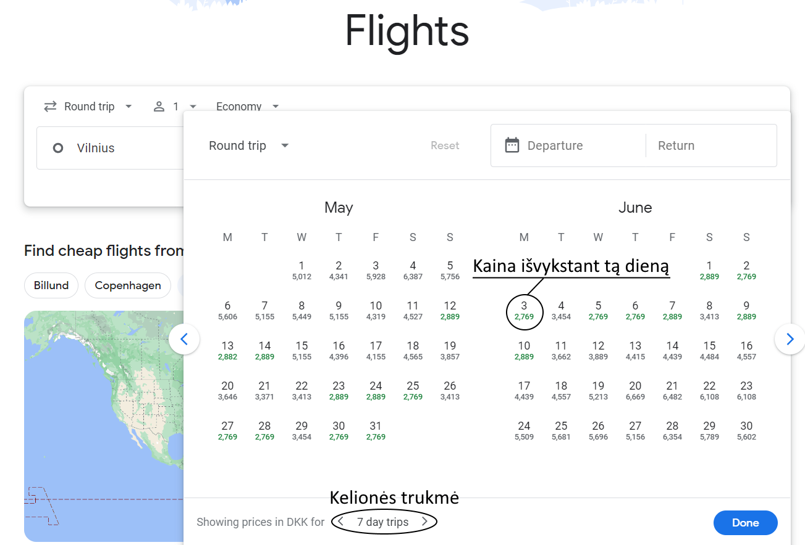
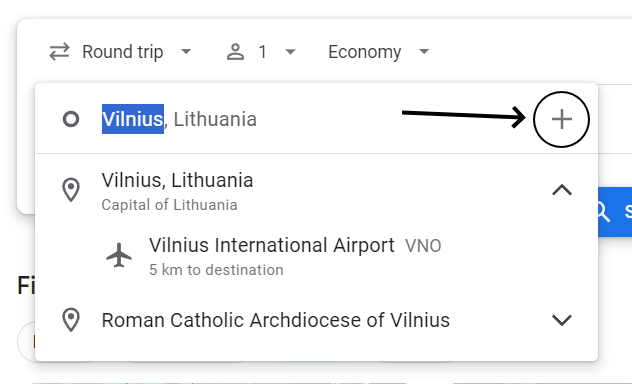
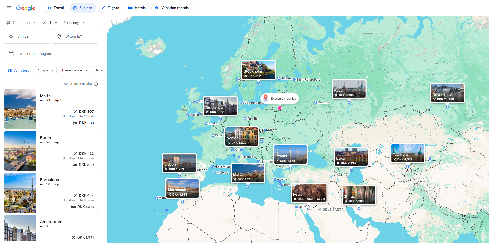

Beveik visada pirmas pirkinys mano kelionės planavimo procese būną lėktuvo bilietai, nes:
- Priverčia jūsų kelionę jaustis tikra. Prieš tai ji yra tik idėja/planas, bet nusipirkus bilietus ji patampa kažkuo "apčiuopiamu".
- Jie dažniausia būna daug mažiau "lankstūs", kitais žodžiai dažnai specifinės išvykimo/grįžimo datų kombinacijos bus pigesnės ir būtų kur kas brangiau/sunkiau pirma užsisakyti viešbučius ir tada bandyti ieškoti jiems tinkančių skrydžių.
- Sukūria kelionės "rėmą". Žinant išvykimo/grįžimo datas leidžia pradėti planuoti kitas jos dalis (viešbučius, miestų vizitus, įvairias rezervacijas ir pnš.)

## Kur jų ieškoti

Neapsiribokite viena ar dviem specifinėm oro linijom (nebent galbūt renkate jų taškus?). Aš visada pradedu paieškas įvairiuose skrydžių agregatoriuose.:

### [Google Skrydžiai](https://www.google.com/travel/flights)


Mano įrenginiuose yra nustatyta anglų kalba ir danų kronos valiuta, bet svetainė yra išversta į Lietuvių kalbą ir palaiko kitas valiutas


Labai patogus įrankis, kuriame vienu metu galite nurodyti keletą išvykimo/atvykimo taškų susirasti gerus pasiūlymus.

Keletas pavyzdžių/patarimų kaip naudotis:

- Žinote iš/į kur norite skristi ir kiek laiko ten praleisti, tiesiog norit susirasti pigiausia variantą:
    - Pasirinkite miestus, paspauskite ant datos ir apačioje nurodykite kelionės trukmę:
    
- Žinote į kur norite skristi, bet nesvarbu iš kurio Lietuvos oro uosto:
    - Renkantis išvykimo vietą paspauskite `+` ir pasirinkite daugiau oro uostų:
    
- Nežinote kur norit nuvykti
    - Nueikite į "Tyrinėti" (angl. "Explore) skiltį, pasirinkite išvykimo tašką ir laiką (tarkim savaitę rugpjūtį):
    


Patarimas - visada pirkite lėktuvų bilietus iš oro linijų. Kartais jie būna pigesni iš perpardavėjų, bet dažnai prarandat įvairias apsaugas.


## Kada jų ieškoti

Nežinau ar galima pilnai atsakyti į šį klausimą, nes visada pasitaiko išimčių. Priklausant nuo skrydžio ilgio, aš pradedu ieškoti skrydžių 2-6 mėnesius prieš išvykimą ir naudojantis įvairias praeities statistikų įrankiais (pvz. Google Skrydžiai dažnai nurodo ar statistiškai jūsų pasirinkto skrydžio kaina yra didesnė ar mažesnė nei praeitais metais). Ir dažniausiai radęs ne per brangų bilietą jį perku labai daug laiko nelaukęs. 

Mano nuomone nebėra labai realistiška bandyti ieškoti paskutinės minutės skrydžių, nes daugelio oro linijų algoritmai ir infrastruktūra yra gan optimizuota jog jie užpildo savo lėktuvus ir dažniausia kaina tik auga likus mažiau vietų. Plius laukiant paskutinės minutės skrydžių greičiausiai permokėsit už viešbučius prarasdami tai ką sutaupėte su lėktuvo bilietais.