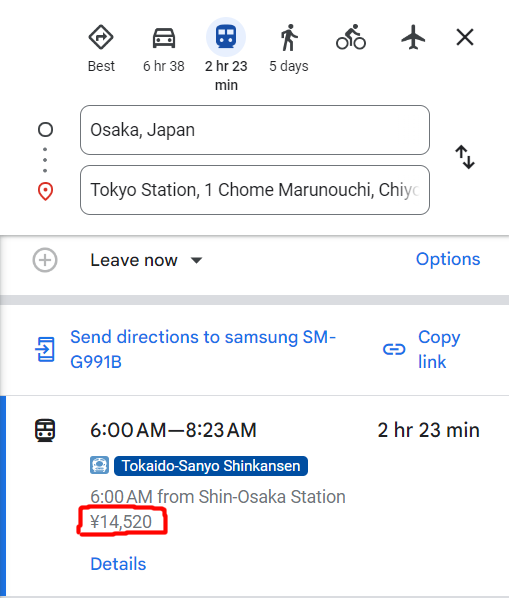

Esu buvęs Japonijoje porą kartų, tad nesu ekspertas, bet užvesti ant kelio galiu.

## Metų laikai

Pradėkim nuo meto laikų kelionės planavimui.

### Vengti

> Pastaba - nėra *būtina* šitų laikų pilnai vengti, bet jie turi negatyvių dalykų kurių daugelis nori vengti

#### Vasara

+25~35 laipsniai ir 80-100% oro drėgmė.

#### Auksinė savaitė

Balandžio gale/Gegužės pradžioje Japonija turi 4 švenčių dienas arti viena kitos, šitas laikotarpis yra vadinamas auksine savaite. Kartu su savaitgaliais ši savaitė tampa vienų užimčiausių laikotarpių - perpildytos lankytinos vietos, problemos įsigyti greitųjų traukinių bilietus ir panašiai.

#### Kiti šventiniai laikotarpiai

Naujų metų pirmoji savaitė, bei "Obon" šventė (rugpjūčio vidurys). Dėl panašių priežasčių kaip ir auksinė savaitė.

### Geri laikai

#### Sausis-Vasaris

Žiemą beveik visada lėktuvų bilietai bus pigiausi. Taip pat žiema Japonijoje nėra baisi - Tokijo, Osakos bei Kijoto miestuose vidutinė dienos temperatūra būna apie +10 laipsnių, bei +2 laipsniai naktį. Tačiau jeigu vyksit į kalnus, tarkim pasimėgauti karštojiom versmėm (ką labai labai rekomenduoju, ypač žiemą), galit tikėtis -10 ir mažiau.

#### Gegužė

Pigesni bilietai palyginus su Kovu-Balandžiu (Sakurų žiedų sezonas kuris pritraukia didžiulius kiekius turistų) bei geras oras neprasidėjus vasaros karščiui.

## Transportas

### IC Kortelės

Metro, traukiniams bei autobusams nusipirkit IC kortelę, yra ne viena, bet populiariausios kiek žinau yra "Suica" bei "Pasmo":

> Pastaba - jeigu turit IPhone telefoną, galit naudoti jį vietoj fizinės kortelės - https://support.apple.com/lt-lt/108772

Kiek žinau skirtumų tarp jų kaip ir nėra, tiesiog skirtingi savininkai. Jas galima nusipirkti beveik visuose oro uostuose vos nusileidus, bei didesnėse traukinių/metro stotyse. Ieškokit "JR East Travel Service Center" (tarkim Narita oro uoste jis yra prie pat traukinių linijų, šalia 'FamilyMart') arba pardavimo/papildymo automatų, tačiau ne visi išduoda korteles:

#### Naudojimas

Įeinant į visas metro stotelės yra vartai:

Į juos galima įdėti popierinį bilietą, arba pridėti kortelę prie ryškaus "IC" ženklo, po kurio atsidaro vartai. Tas pats išeinant iš stoties.

Papildyti kortelę galima beveik kiekvienoj stotyje, papildymo automatuose su "IC"/"Suica"/"Pasmo" ženklais. Kiek žinau visuose galima pakeisti kalbą į anglų ir visas procesas yra įdėti kortelę, pasirinkti sumą ir sumokėti. Vienas "kabliukas" - šie automatai dažnai priema tiktais grynuosius.

### Rail Pass

Japonija turistams turi įvairių traukinių bilietų 'paketų', populiariausias yra "Japan Rail Pass" - 7/14/21 dienas galit naudotis beveik visais traukiniais be papildomų išlaidų (nebent norit sėdėti pirmoj klasėje ar panašiai). Tai buvo labai geras pasirinkimas iki 2023 rudens, kai šių paketų kainos buvo padidintos 20-80%. Dabar reikia gerai pasiskaičiuoti ar jis jums apsimoka. Pavyzdys:

Šiuo metu 7 dienų rail pass kainuoja 50.000 jenų (~290 EUR). Populiariausias turistų maršrutas pirmą kartą Japonijoje paprastai yra Tokijus - Kyoto - Osaka - Tokijus.

- Tokijus - Kyoto: 13.970 jenų (~81 EUR)
- Kyoto - Osaka: 1.670 jenų (greitasis traukinys) / 580 jenų (regioninis traukinys, 15 minu2ių lėtesnis)
- Osaka - Tokijus: 14.520 (~84 eurai)

Iš viso 30.160 jenų kas yra beveik perpus pigiau nei Rail Pass.

P.S. traukinių kainas galit pamatyti tiesiog Google žemėlapiuose: 

Tarp kitko yra daugiau panašių traukinių paketų skirtų mažesniems regionams kurie gali tikti jūsų kelionei - https://www.japan-guide.com/e/e2357.html

## Internetas

Yra 3 pagrindiniai pasirinkimai:

- E-sim (elektroninė sim kortelė)
  - Ne visi telefonai palaiko
  - Tai leidžia parsisiųsti programėlę, kuri sukuria virtualią sim kortelę (paprastai nemokamai) ir tada galite užsisakyti jums norimą interneto planą
  - Tarkim aš naudojau [Ubigi](https://cellulardata.ubigi.com/), kuris turėjo 10Gb planą mėnesiui už 17 eurų.
- Sim kortelė
  - Brangiau nei e-sim, nes pati kortelė kainuos ~20 eurų ir planai greičiausiai bus net brangesni
- Nešiojamas modemas
  - Galima išsinuomoti oro uostuose
  - Dažniausiai bus brangiausias variantas (~2-5 eurai per dieną)
    - Nebent esat didesnėje grupėje

## Kiti patarimai

- Turėkit visada grynųjų. Didieji miestai beveik visada priema korteles, bet dažnai pasitaiko mažesnių įstaigų, kurios visdar priema tik grynuosius
  - Tarp kitko geriausias bankomatas yra 7-11 parduotuvėse (mažiausi mokesčiai)
- Jeigu yra galimybė - skriskit į Haneda oro uostą. Narita yra ~1 valanda kelionė traukiniu nuo Tokijo.
- Jeigu nemokat, išmokit valgyti "lazdelėmis"
  - Tai nėra sunku, tiesiog reikia praktikos. 
  - Yra pilna gidų internete, tarkim vienas LNK klipas - https://www.youtube.com/watch?v=9efCAysCgyE
  - Lazdelės nėra skirtos tik sushi, praktikai valgykit kasdieninį maistą lazdelėm prieš kelionę
- Išmokit paprastų japoniškų frazių
  - Tarkim viena auksinė frazė restoranuose neturinčių angliško meniu - "Osusume onegaishimasu" (o-su-su-mė o-ne-gai-ši-mas), Netiesiogiai išvertus "Užsisakysiu tai ką rekomenduojat".
- Aplankykit vietas toliau nuo didžiųjų miestų. Tokijus ar Osaka neatspindi visos Japonijos, yra daug įdomių vietų ir be jų (taip pat kaip tarkim Vilniaus senamiestis neatspindi visos Lietuvos).
- Nekalbėkit telefonu viešam transporte
- Didžioji dalis viešbučių turi skalbimo mašinas, nepersikraukit drabužių
- Jeigu norit pamatyti Sumo - planuokit iš anksto. Per metus tėra 6 turnyrai (ne visi Tokijuje) ir bilietai yra gan populiarūs
  - 
